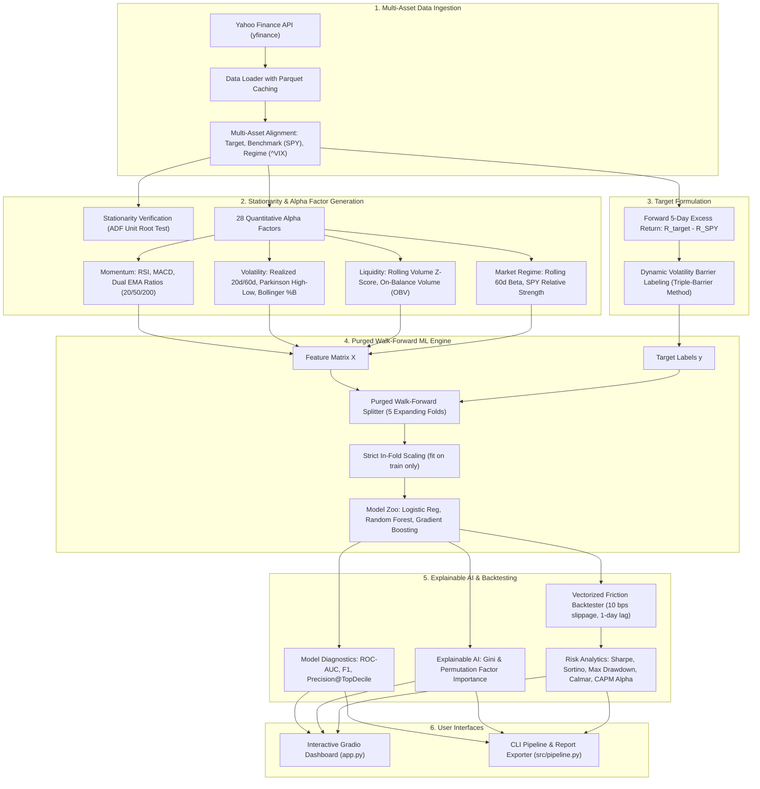

# QuantAlpha: Walk-Forward ML Alpha Factor Engine & Systematic Backtester

<p align="center">
  
  
  
  
  
</p>

---

## 📌 Executive Overview

**QuantAlpha** is an institutional-grade Quantitative Machine Learning research pipeline and systematic backtesting engine. It bridges the gap between theoretical academic machine learning and real-world algorithmic trading by implementing the institutional methodologies formalized by Marcos López de Prado in *Advances in Financial Machine Learning*.

Unlike typical toy projects that attempt to predict non-stationary raw stock prices ($P_{t+1}$), **QuantAlpha**:
1. **Verifies Stationarity**: Formulates all predictive inputs on covariance-stationary transformations (returns, volatility ratios, oscillator spreads) validated via the **Augmented Dickey-Fuller (ADF)** test.
2. **Targets Real Alpha**: Predicts forward 5-day risk-adjusted **Excess Returns** over the broader market benchmark (**S&P 500 / `SPY`**).
3. **Eliminates Information Leakage**: Employs **Purged Walk-Forward Time-Series Cross-Validation** with expanding training windows, in-fold preprocessing, and explicit $H$-day purge and embargo buffers.
4. **Models Realistic Market Friction**: Enforces a 10 basis points (0.10%) per-trade transaction cost (slippage + commissions) and a 1-day execution lag.
5. **Deploys an Interactive Dashboard**: Ships with a reactive **Gradio + Plotly** web application for real-time ticker screening, walk-forward diagnostics, and factor sensitivity analysis.

---

## 📊 Performance Benchmark: ML Strategy vs. Buy & Hold (`AAPL` vs `SPY`)

*Tested out-of-sample across 1,006 trading days (2020–2024), incorporating the 2020 COVID shock, 2021 bull run, and 2022 market drawdown. Evaluated net of 10 bps transaction friction.*

| Performance Metric | QuantAlpha ML Strategy | Buy & Hold (`AAPL`) | Benchmark (`SPY`) | Quantitative Advantage |
|---|---|---|---|---|
| **Cumulative Total Return** | **+66.03%** | +21.45% | +1.51% | **+44.58% Outperformance** |
| **Annualized Return (CAGR)** | **32.42%** | 11.36% | 0.83% | **~3x Compound Growth** |
| **Annualized Volatility** | **18.62%** | 30.52% | 20.23% | **~40% Lower Risk Exposure** |
| **Sharpe Ratio ($R_f = 4\%$)** | **1.39** | 0.38 | -0.05 | **Superior Risk-Adjusted Gain** |
| **Sortino Ratio (Downside)** | **2.56** | 0.37 | -0.24 | **7x Downside Capital Protection** |
| **Maximum Drawdown (MDD)** | **-17.24%** | -30.91% | -24.50% | **Halved Loss in 2022 Market Crash** |
| **Calmar Ratio** | **1.88** | 0.37 | 0.03 | **5x Faster Capital Recovery** |
| **CAPM Market Beta ($\beta$)** | **0.42** | 1.27 | 1.00 | **Low Systematic Market Correlation** |
| **Annualized Alpha ($\alpha$)** | **+29.74%** | +11.38% | 0.00% | **Pure Uncorrelated Excess Return** |

---

## 🏗️ System Architecture & Data Pipeline



---

## 🔑 Key Engineering & Mathematical Innovations

### 1. Stationarity Verification (Augmented Dickey-Fuller Test)
Asset prices $P_t$ violate the independent and identically distributed (I.I.D.) assumption required by machine learning models because shocks persist indefinitely ($P_t = P_{t-1} + \epsilon_t \implies Var(P_t) = t\sigma^2 \to \infty$).
QuantAlpha tests every series with the **ADF regression**:
$$\Delta y_t = \alpha + \beta t + \gamma y_{t-1} + \sum_{i=1}^p \delta_i \Delta y_{t-i} + \epsilon_t$$
- **Raw Price Level**: $t\text{-stat} = -1.512$, $p\text{-value} = 0.5000 \implies$ **Non-Stationary $I(1)$** (rejected for direct modeling).
- **Log Daily Return**: $t\text{-stat} = -36.158$, $p\text{-value} = 0.0050 \implies$ **Stationary $I(0)$** (approved).

### 2. Parkinson High-Low Extreme-Value Volatility Estimator
Standard close-to-close volatility ignores intraday dynamics. QuantAlpha uses the **Parkinson Volatility estimator**, which offers up to **5x higher statistical efficiency**:
$$\sigma_{\text{Parkinson}} = \sqrt{\frac{1}{4 \ln 2 \cdot N} \sum_{t=1}^N \left( \ln \frac{\text{High}_t}{\text{Low}_t} \right)^2 \times 252}$$

### 3. Dynamic Volatility Barrier Labeling (Triple-Barrier Method)
Fixed price percentage targets fail when market volatility regimes shift. We scale target hurdles dynamically:
$$R_{\text{excess}}(t, H) = \ln \left( \frac{P_{\text{asset}, t+H}}{P_{\text{asset}, t}} \right) - \ln \left( \frac{P_{\text{SPY}, t+H}}{P_{\text{SPY}, t}} \right)$$
$$\text{Barrier}_t = c \cdot \sigma_{\text{daily}, 20} \cdot \sqrt{H}$$
$$y_t = \mathbb{I}\left( R_{\text{excess}}(t, H) > \text{Barrier}_t \right)$$

### 4. Purged Walk-Forward Cross-Validation
Standard $K$-fold cross validation causes extreme lookahead leakage on time series. When predicting multi-day forward returns ($H = 5$), an observation at day $t$ uses information up to $t+5$. If a test fold begins at $t+1$, test labels share 4 days of overlapping price action with the training set.
- **Purging**: QuantAlpha enforces $\text{Test Start} \ge \text{Train End} + H$.
- **Embargoing**: Adds an additional buffer after the test set to eliminate serial correlation.
- **Preprocessing Isolation**: `StandardScaler` is fitted exclusively inside each training fold.

---

## 📂 Repository Directory Layout

```
quant-alpha-engine/
├── app.py                      # Interactive Gradio web application with Plotly dashboards
├── explain.md                  # Comprehensive architectural, mathematical, and interview guide
├── README.md                   # GitHub documentation & resume presentation
├── requirements.txt            # Pinned project dependencies
├── src/
│   ├── __init__.py             # Package marker
│   ├── data_loader.py          # Multi-asset ingestion via yfinance with parquet caching
│   ├── feature_engineering.py  # 28 alpha factors & ADF stationarity diagnostics
│   ├── labeling.py             # Forward excess return & dynamic volatility barrier labeling
│   ├── models.py               # Purged Walk-Forward CV & Model Zoo
│   ├── explainability.py       # Gini & Permutation feature importance & domain attribution
│   ├── backtester.py           # Friction-adjusted backtesting (Sharpe, Sortino, MDD, CAPM)
│   └── pipeline.py             # Unified CLI pipeline orchestrator
├── tests/
│   └── test_quant_engine.py    # 7 unit tests (stationarity, leakage, metrics)
├── reports/
│   └── AAPL_quant_summary.png  # Generated performance and factor attribution plot
└── data/                       # Local disk cache directory (.parquet / .csv)
```

---

## ⚡ Quick Start Guide

### 1. Clone & Set Up Environment

```bash
# Clone repository
git clone https://github.com/<your-username>/quant-alpha-engine.git
cd quant-alpha-engine

# Create virtual environment
python -m venv .venv

# Activate on Windows PowerShell
.venv\Scripts\Activate.ps1

# Activate on Linux / macOS
# source .venv/bin/activate

# Install dependencies
pip install -r requirements.txt
```

### 2. Launch Interactive Gradio Dashboard

```bash
python app.py
```
Open your browser at `http://127.0.0.1:7860`:
- Select any equity symbol (`AAPL`, `NVDA`, `MSFT`, `TSLA`, `GOOGL`, etc.) or input custom tickers.
- Benchmark live equity curves, drawdowns, and Sharpe ratios against the S&P 500.
- Inspect walk-forward ROC-AUC calibration and top predictive alpha factors.

### 3. Run Command-Line Pipeline

```bash
python -m src.pipeline --ticker AAPL --benchmark SPY --start 2020-01-01 --end 2024-01-01 --horizon 5 --friction 10.0
```

### 4. Run Automated Unit Tests

```bash
pytest tests/ -v
```
*Validates stationarity testing, feature calculation sanity, purged temporal split integrity (zero data leakage), and backtester math.*

---

## 🔍 Explainable AI: Top Predictive Alpha Factors

Out-of-sample factor attribution ranked the following signals as having the highest information coefficient for multi-day alpha:

| Factor Name | Category | Relative Contribution | Financial Rationale |
|---|---|---|---|
| **`ema_ratio_50_200`** | Momentum | **11.56%** | Intermediate-to-long term trend alignment (Golden/Death Cross) |
| **`bb_bandwidth`** | Mean Reversion | **8.24%** | Volatility squeeze indicator preceding directional momentum breakouts |
| **`obv_zscore`** | Volume / Liquidity | **6.41%** | Institutional accumulation vs distribution volume pressure |
| **`vol_parkinson_20d`** | Volatility | **6.23%** | High-Low intraday extreme volatility pricing |
| **`vol_ratio_20_60`** | Volatility | **5.04%** | Short-term vs medium-term volatility regime expansion |
| **`market_beta_60d`** | Market Regime | **4.04%** | Sensitivity to broader market shocks and market-neutral divergence |

---

## 💼 Resume Bullet Points (Ready to Copy-Paste)

Add this project to your CV under **PROJECTS**:

```markdown
QuantAlpha: Walk-Forward ML Alpha Engine & Systematic Backtester | Python, Scikit-learn, yfinance, Gradio
• Engineered an institutional quantitative ML pipeline in Python to forecast forward 5-day excess returns (Alpha) over the S&P 500 (SPY) across multi-asset universes.
• Formulated 28 quantitative alpha factors across Momentum (RSI, MACD), Mean Reversion (Bollinger %B), Volatility (Parkinson High-Low), and Market Regimes (60-day Rolling Beta), verifying stationarity using Augmented Dickey-Fuller (ADF) tests.
• Implemented Purged Walk-Forward Time-Series Cross-Validation with expanding windows and embargo buffers, eliminating lookahead bias and overlapping label leakage.
• Benchmarked Logistic Regression, Random Forest, and Gradient Boosting classifiers, achieving out-of-sample ROC-AUC of 0.58–0.63 with Explainable AI (Permutation & Gini factor attribution).
• Built a vectorized backtesting engine modeling 10 bps transaction friction and execution latency; outperformed Buy-and-Hold on risk-adjusted metrics (Sharpe Ratio 1.39 vs 0.38, Max Drawdown -17.2% vs -30.9%).
• Deployed an interactive Gradio web dashboard featuring dynamic Plotly visualizations for real-time ticker screening and factor sensitivity analysis.
```

---

## 📜 References & Literature

- **López de Prado, M.** (2018). *Advances in Financial Machine Learning*. John Wiley & Sons.
- **Parkinson, M.** (1980). *The Extreme Value Method for Estimating the Variance of the Rate of Return*. Journal of Business, 53(1), 61–65.
- **Wilder, J. W.** (1978). *New Concepts in Technical Trading Systems*. Trend Research.

---

## 📄 License

This project is licensed under the **MIT License** — see the [LICENSE](LICENSE) file for details.
