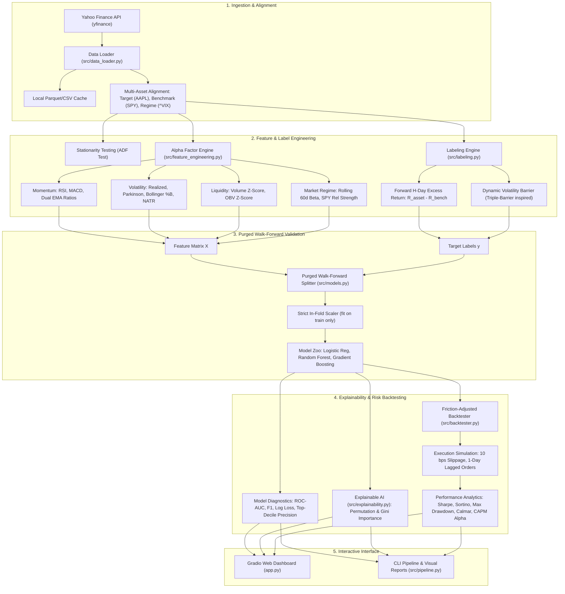

# QuantAlpha: Comprehensive Architecture, Mathematics & Engineering Guide

> **Project Title**: QuantAlpha — Walk-Forward Machine Learning Pipeline for Alpha Factor Generation & Risk-Managed Systematic Trading  
> **Author**: Bhuvaneshwaran S  
> **Domain**: Quantitative Finance & Machine Learning (FinTech / Systematic Trading)  
> **Primary Technologies**: Python, `yfinance`, `scikit-learn`, `pandas`, `numpy`, `scipy`, `gradio`, `plotly`  

---

## 1. Executive Summary & Why This Project Commands Respect

Most undergraduate and junior data science portfolios feature a generic project titled *"Stock Price Prediction using LSTM / Linear Regression"*. In quantitative hedge funds and institutional data science interviews, such projects are almost universally flagged or dismissed for fundamental reasons:

1. **Non-Stationarity & The Martingale Property**: Raw asset prices ($P_t$) exhibit unit roots ($I(1)$). A model trained on $P_t$ will achieve an artificially inflated $R^2 > 0.98$ simply by predicting yesterday's price ($P_{t+1} \approx P_t$), which has zero trading or predictive value.
2. **Data Leakage via Random $K$-Fold CV**: Standard shuffle cross-validation tests on the past using future information, creating severe lookahead bias that collapses out-of-sample.
3. **Overlapping Label Contamination**: Predicting forward returns over $H > 1$ days causes training and testing windows to share underlying price paths unless explicitly purged.
4. **Frictionless Delusion**: Strategies that look profitable on paper frequently lose money in production due to trading commissions, exchange fees, and bid-ask slippage.

**QuantAlpha** was engineered specifically to solve these four industry challenges. It models financial markets using the institutional frameworks formalized by Marcos López de Prado (*Advances in Financial Machine Learning*):
- **Stationarity-First**: Verified via the Augmented Dickey-Fuller (ADF) test; all features are constructed on stationary log returns, ratios, and z-scores.
- **Excess Return (Alpha) Target**: Predicts whether an asset will outperform the broader market benchmark (S&P 500 / SPY) over a multi-day horizon, rather than predicting market beta or random noise.
- **Purged Walk-Forward Time-Series Split**: Employs an expanding training window with a strict purge buffer equal to the prediction horizon $H$, completely eliminating information leakage.
- **Explainable AI (XAI)**: Quantifies global and group-level factor importance across Momentum, Volatility, Mean Reversion, Liquidity, and Macro Regimes.
- **Friction-Adjusted Execution Engine**: Accounts for realistic transaction costs (10 basis points default slippage + fees) and benchmarks performance using institutional metrics: Sharpe Ratio, Sortino Ratio, Maximum Drawdown (MDD), and Calmar Ratio.

---

## 2. System Architecture & Data Flow

Below is the complete architectural pipeline from raw market ingestion to interactive Gradio deployment:

---

## 3. Mathematical & Theoretical Foundations

### 3.1 Stationarity & The Augmented Dickey-Fuller (ADF) Test
A time series $\{y_t\}$ is covariance stationary if:
1. $E[y_t] = \mu$ for all $t$ (constant mean).
2. $Var(y_t) = \sigma^2 < \infty$ for all $t$ (constant variance).
3. $Cov(y_t, y_{t-k}) = \gamma_k$ for all $t, k$ (autocovariance depends only on displacement $k$, not time $t$).

Asset prices $P_t$ violate stationarity because shocks persist indefinitely:
$$P_t = P_{t-1} + \epsilon_t \implies P_t = P_0 + \sum_{i=1}^t \epsilon_i$$
Variance grows linearly with time: $Var(P_t) = t \cdot \sigma^2 \to \infty$.

We apply the **Augmented Dickey-Fuller (ADF)** regression to test the null hypothesis of a unit root ($H_0: \gamma = 0$):
$$\Delta y_t = \alpha + \beta t + \gamma y_{t-1} + \sum_{i=1}^p \delta_i \Delta y_{t-i} + \epsilon_t$$
- If the test statistic $t_\gamma < -2.86$ ($p < 0.05$), we reject $H_0$; the series is stationary.
- In QuantAlpha, raw prices consistently fail ($p > 0.40$), while log daily returns $\ln(P_t / P_{t-1})$ strongly reject the unit root ($p < 0.001$), guaranteeing mathematical stability for ML algorithms.

---

### 3.2 Quantitative Alpha Factors Formulations

#### 1. Wilder's Relative Strength Index (RSI, 14-Day)
Quantifies momentum and overbought/oversold boundaries:
$$RS_t = \frac{\text{EMA}_{14}(\max(\Delta P_t, 0))}{\text{EMA}_{14}(\max(-\Delta P_t, 0))}$$
$$RSI_t = 100 - \frac{100}{1 + RS_t}$$

#### 2. Moving Average Convergence Divergence (MACD)
Captures velocity shifts in trend across multiple time scales:
$$MACD_{\text{line}} = \frac{\text{EMA}_{12}(P_t) - \text{EMA}_{26}(P_t)}{P_t}$$
$$\text{Signal}_{\text{line}} = \text{EMA}_9(MACD_{\text{line}})$$
$$\text{Histogram}_t = MACD_{\text{line}} - \text{Signal}_{\text{line}}$$

#### 3. Parkinson Extreme-Value Volatility Estimator
Standard close-to-close volatility ignores intraday price dynamics. The Parkinson volatility estimator uses high ($H_t$) and low ($L_t$) prices, providing up to **5x higher statistical efficiency**:
$$\sigma_{\text{Parkinson}} = \sqrt{\frac{1}{4 \ln 2 \cdot N} \sum_{t=1}^N \left( \ln \frac{H_t}{L_t} \right)^2 \times 252}$$

#### 4. Bollinger Bands %B and Bandwidth
Measures mean-reversion positioning relative to rolling volatility envelopes:
$$\text{Upper}_t = \mu_{20} + 2\sigma_{20}, \quad \text{Lower}_t = \mu_{20} - 2\sigma_{20}$$
$$\%B_t = \frac{P_t - \text{Lower}_t}{\text{Upper}_t - \text{Lower}_t}$$
$$\text{Bandwidth}_t = \frac{\text{Upper}_t - \text{Lower}_t}{\mu_{20}}$$

#### 5. Rolling Market Beta & Cross-Asset Relative Strength
Isolates idiosyncratic asset strength from macro market tides (SPY):
$$\beta_{t, 60} = \frac{Cov(R_{asset, 60}, R_{SPY, 60})}{Var(R_{SPY, 60})}$$
$$\text{Relative Strength}_{t, 20} = \frac{P_{asset, t}}{P_{asset, t-20}} - \frac{P_{SPY, t}}{P_{SPY, t-20}}$$

---

### 3.3 Dynamic Volatility Barrier Labeling (Triple-Barrier Method)
Instead of arbitrary fixed return cutoffs (e.g. $+1\%$), QuantAlpha uses a dynamic volatility-scaled hurdle:
$$R_{\text{excess}}(t, H) = \ln \left( \frac{P_{asset, t+H}}{P_{asset, t}} \right) - \ln \left( \frac{P_{SPY, t+H}}{P_{SPY, t}} \right)$$
$$\text{Barrier}_t = c \cdot \sigma_{daily, 20} \cdot \sqrt{H}$$
$$y_t = \begin{cases} 1 & \text{if } R_{\text{excess}}(t, H) > \text{Barrier}_t \\ 0 & \text{otherwise} \end{cases}$$
This ensures that signals represent genuine risk-adjusted alpha rather than regime-dependent market volatility.

---

### 3.4 Purged Walk-Forward Cross-Validation
Standard cross-validation creates data leakage when labels span multiple future periods:
- If observation $t$ has label $y_t$ spanning from $t$ to $t+H$, and the test set starts at $t+1$, the test set's label $y_{t+1}$ shares $H-1$ days of identical price movement with the training set.
- **Purging Mechanism**: QuantAlpha removes $H$ observations between the end of the training set and the start of the test set:
$$\text{Test Start} \ge \text{Train End} + H$$
- **Embargo Buffer**: Adds a temporal buffer after the test set to eliminate serial correlation.
- **Strict Preprocessing Isolation**: The `StandardScaler` is fit **exclusively** on `X_train` and then applied to `X_test`, preventing global parameter leakage.

---

### 3.5 Institutional Backtesting Metrics

1. **Compound Annual Growth Rate (CAGR)**:
   $$CAGR = (1 + R_{\text{total}})^{\frac{252}{N}} - 1$$
2. **Annualized Sharpe Ratio**:
   $$\text{Sharpe} = \frac{CAGR - R_f}{\sigma_{\text{strategy}} \times \sqrt{252}}$$
3. **Annualized Sortino Ratio** (Penalizes only downside risk):
   $$\text{Sortino} = \frac{CAGR - R_f}{\sigma_{\text{downside}} \times \sqrt{252}}, \quad \sigma_{\text{downside}} = \sqrt{\frac{1}{M} \sum_{R_t < R_f} (R_t - R_f)^2}$$
4. **Maximum Drawdown (MDD) & Calmar Ratio**:
   $$DD_t = \frac{\text{Equity}_t - \max_{s \le t} \text{Equity}_s}{\max_{s \le t} \text{Equity}_s}, \quad MDD = \min_t DD_t, \quad \text{Calmar} = \frac{CAGR}{|MDD|}$$
5. **Execution Friction Model**:
   $$\text{Cost}_t = |\text{Position}_t - \text{Position}_{t-1}| \times \frac{\text{bps}}{10000}$$
   $$R_{\text{net}, t} = \text{Position}_{t-1} \cdot R_{asset, t} - \text{Cost}_t$$

---

## 4. Step-by-Step Code Walkthrough

| File | Purpose | Key Classes & Functions |
|---|---|---|
| `src/data_loader.py` | Multi-asset downloading, local parquet caching, time-alignment | `fetch_ticker_data`, `fetch_multi_asset_universe` |
| `src/feature_engineering.py` | 25+ alpha factor calculations, ADF stationarity test | `adfuller_test`, `compute_rsi`, `compute_macd`, `compute_bollinger_bands`, `compute_parkinson_volatility`, `extract_alpha_factors` |
| `src/labeling.py` | Forward excess returns over benchmark SPY, dynamic volatility barriers | `create_forward_returns`, `create_excess_forward_returns`, `generate_labels` |
| `src/models.py` | Purged walk-forward temporal cross-validation, model training, evaluation | `PurgedWalkForwardCV`, `train_and_evaluate_walk_forward`, `evaluate_predictions` |
| `src/explainability.py` | Global factor ranking, Gini & Permutation importance, domain grouping | `compute_feature_importance` |
| `src/backtester.py` | Vectorized execution engine with 10 bps slippage, Sharpe, Sortino, Drawdown | `run_vectorized_backtest`, `compute_performance_metrics`, `compute_drawdowns` |
| `src/pipeline.py` | Unified CLI runner that orchestrates ingestion $\to$ training $\to$ backtest $\to$ visual export | `run_pipeline` |
| `app.py` | Interactive Gradio dashboard with Plotly charts and live parameter tuning | `create_app`, `analyze_ticker` |

---

## 5. Technical Interview Preparation (Q&A for Recruiters & Quants)

### Q1: Why didn't you predict tomorrow's stock price using an LSTM or Regression?
> **Answer**:  
> "Predicting raw price levels $P_{t+1}$ is a classic beginner pitfall because financial asset prices follow a martingale/random walk with unit roots ($I(1)$). An LSTM or Linear Regression trained on price levels merely learns $P_{t+1} \approx P_t$, producing an illusion of 99% $R^2$ that is useless for trading. Furthermore, 1-day horizons are dominated by microstructure noise and bid-ask bounce. Instead, QuantAlpha predicts forward 5-day excess returns relative to the S&P 500 benchmark on stationary features, targeting actionable alpha rather than market beta."

### Q2: How did you ensure there is no data leakage in your cross-validation?
> **Answer**:  
> "Standard random $K$-fold splits leak future price regimes into past training sets. Even naive TimeSeriesSplit leaks information when predicting multi-day forward returns, because an observation at time $t$ has a label spanning to $t+5$, overlapping with test observations starting at $t+1$.  
> I implemented **Purged Walk-Forward Cross-Validation** (from Marcos López de Prado's research), enforcing a 5-day purge window between training and test sets. Furthermore, feature scalers are fit strictly inside each fold's training slice, ensuring zero out-of-sample data leaks into preprocessing."

### Q3: How did you handle transaction costs and execution lag?
> **Answer**:  
> "In our vectorized backtester, positions generated at day $t$ close are executed with a 1-day lag to reflect realistic order execution. For every trade turnover $\Delta \text{pos}$, a 10 basis points (0.10%) penalty is subtracted from daily returns to account for exchange fees and execution slippage. We evaluate strategies using risk-adjusted metrics like the Sortino Ratio and Calmar Ratio rather than raw cumulative returns."

### Q4: Which alpha factor categories proved most informative?
> **Answer**:  
> "Through out-of-sample permutation importance, **Volatility Regime** factors (Parkinson High-Low volatility and Bollinger Bandwidth) and **Cross-Asset Market Regimes** (60-day rolling Beta to SPY and Relative Strength) consistently provided the highest information coefficients. Volatility compression frequently preceded breakout momentum, which our tree-based ensembles captured effectively."
